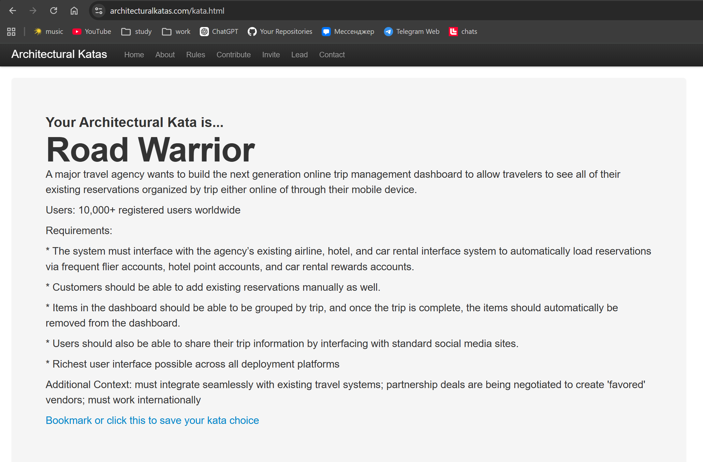

# Road Warrior — сервис управления поездками

## 1. Тема и целевая аудитория

### Тема проекта

**Road Warrior** — онлайн-сервис для управления бронированиями пользователя, сгруппированными по поездкам.

**Фокус MVP:** веб-панель для просмотра поездок, автоматической загрузки бронирований из внешних систем, ручного добавления бронирований, архива завершённых поездок и безопасного шаринга.

### Вводные по кейсу

| Параметр | Значение |
|---|---|
| Название каты | Road Warrior |
| Заказчик | крупное туристическое агентство |
| Пользователи | 10 000+ зарегистрированных пользователей по всему миру |
| Основной сценарий | просмотр существующих бронирований, сгруппированных по поездкам |
| Платформы | веб и мобильные устройства |
| Доп. контекст | Россия, 2026 год |
| Особенность | интеграция с существующими системами авиакомпаний, отелей и аренды автомобилей |

### Целевая аудитория

| Сегмент | Описание |
|---|---|
| Частые путешественники | пользователи с несколькими бронированиями в разных системах |
| Клиенты туристического агентства | пользователи, чьи бронирования проходят через агентство |
| Международные пользователи | пользователи с поездками между странами, разными валютами и часовыми поясами |

### MVP-функционал

| Функция | Описание |
|---|---|
| Панель поездок | список активных поездок пользователя |
| Автоматическая загрузка бронирований | импорт из систем авиакомпаний, отелей и аренды автомобилей |
| Подключение аккаунтов программ лояльности | авиакомпании, отели, аренда автомобилей |
| Ручное добавление бронирований | добавление существующего бронирования вручную |
| Группировка по поездкам | объединение бронирований в поездки |
| Архив завершённых поездок | завершённые поездки скрываются из активной панели |
| Шаринг поездки | доступ к поездке через ссылку общего доступа |
| Адаптивный интерфейс | интерфейс для ПК и мобильных устройств |

---

## 2. Отсев

### Требования из кейса

| Исходное требование | Решение для MVP |
|---|---|
| Система должна интегрироваться с существующими интерфейсами авиакомпаний, отелей и сервисов аренды автомобилей | входит |
| Система должна автоматически загружать бронирования через аккаунты программ лояльности | входит |
| Пользователь должен иметь возможность вручную добавить существующее бронирование | входит |
| Бронирования должны группироваться по поездкам | входит |
| После завершения поездки бронирования должны автоматически пропадать из активной панели | входит как перенос в архив |
| Пользователь должен иметь возможность поделиться информацией о поездке через социальные сети | входит как ссылка общего доступа |
| Интерфейс должен быть максимально функциональным на всех поддерживаемых платформах | уточняется как адаптивный веб-интерфейс для ПК и мобильных устройств |
| Система должна бесшовно интегрироваться с существующими системами бронирования | входит через поддержанные интерфейсы агентства |
| Партнёрские поставщики должны учитываться в продукте | в MVP только хранение признака партнёрского поставщика |
| Система должна работать международно | входит: часовые пояса, валюты, языки, международные форматы |

### Исключено из MVP

| Функция | Статус |
|---|---|
| Покупка билетов, отелей, аренды авто | не входит |
| Оплата и возвраты | не входит |
| Управление бонусными баллами | не входит |
| Начисление и списание бонусов | не входит |
| Нативные приложения iOS / Android | не входит |
| Работа без подключения к интернету | не входит |
| Интеграция со всеми мировыми поставщиками сразу | не входит |
| Прямая интеграция с API каждой соцсети | не входит |
| Продвижение партнёрских поставщиков в интерфейсе | не входит |
| Рекомендации маршрутов | не входит |
| Планирование поездок | не входит |

---

## 3. Scope Refinement

### Границы MVP

| Входит | Не входит |
|---|---|
| Регистрация и авторизация | покупка новых бронирований |
| Подключение аккаунтов программ лояльности | оплата |
| Автоматическая синхронизация бронирований | возвраты |
| Ручное добавление бронирований | управление бонусными баллами |
| Редактирование ручных бронирований | нативные мобильные приложения |
| Удаление ручных бронирований | работа без подключения к интернету |
| Панель активных поездок | корпоративные командировки |
| Группировка бронирований по поездкам | согласование командировок |
| Ручное исправление группировки | рекомендации маршрутов |
| Архив завершённых поездок | рекламная модель партнёрских поставщиков |
| Ссылка общего доступа на поездку | глубокая интеграция с соцсетями |
| Статус последней синхронизации | полноценная CRM для агентства |

### Роли

| Роль | Описание |
|---|---|
| Пользователь | управляет поездками и бронированиями |
| Система синхронизации | загружает бронирования из внешних систем |
| Внешняя система бронирования | авиакомпания, отель, сервис аренды автомобилей |
| Администратор поддержки | смотрит ошибки синхронизации |

### Основные сущности

| Сущность | Описание |
|---|---|
| `user` | пользователь сервиса |
| `connected_account` | подключенный аккаунт программы лояльности |
| `reservation` | бронирование: рейс, отель, аренда авто |
| `trip` | группа бронирований в рамках одной поездки |
| `vendor` | поставщик услуги |
| `share_link` | ссылка для просмотра поездки |
| `sync_job` | задача синхронизации |
| `sync_log` | результат обращения к внешней системе |

### Основные сценарии

| Сценарий | Результат |
|---|---|
| Пользователь подключает аккаунт программы лояльности | создаётся `connected_account`, запускается синхронизация |
| Система загружает бронирования | создаются или обновляются `reservation` |
| Пользователь добавляет бронирование вручную | создаётся `reservation` с типом `manual` |
| Система группирует бронирования | создаётся или обновляется `trip` |
| Пользователь исправляет группировку | меняется связь `reservation -> trip` |
| Поездка завершается | `trip` переходит в `archived` |
| Пользователь делится поездкой | создаётся `share_link` |
| Пользователь отключает шаринг | `share_link` становится неактивной |

---

## 4. Функциональные требования

### Требования

| ID | Требование | Приоритет |
|---:|---|---|
| 1 | Пользователь может зарегистрироваться и войти в систему | обязательное |
| 2 | Пользователь может подключить аккаунт программы лояльности авиакомпании | обязательное |
| 3 | Пользователь может подключить аккаунт отельной программы лояльности | обязательное |
| 4 | Пользователь может подключить аккаунт программы лояльности сервиса аренды автомобилей | обязательное |
| 5 | Пользователь может отключить подключенный аккаунт программы лояльности | обязательное |
| 6 | Система автоматически запускает синхронизацию подключенных аккаунтов | обязательное |
| 7 | Система загружает бронирования из систем авиакомпаний, отелей и аренды автомобилей | обязательное |
| 8 | Система приводит бронирования к единой модели `reservation` | обязательное |
| 9 | Система дедуплицирует одинаковые бронирования из разных источников | обязательное |
| 10 | Пользователь может добавить бронирование вручную | обязательное |
| 11 | Пользователь может редактировать вручную добавленное бронирование | обязательное |
| 12 | Пользователь может удалить вручную добавленное бронирование | обязательное |
| 13 | Пользователь видит активные поездки в панели поездок | обязательное |
| 14 | Система группирует бронирования по поездкам | обязательное |
| 15 | Пользователь может вручную перенести бронирование в другую поездку | желательное |
| 16 | Система переносит завершённые поездки в архив | обязательное |
| 17 | Пользователь может просматривать архив поездок | желательное |
| 18 | Пользователь может создать ссылку общего доступа на поездку | обязательное |
| 19 | Пользователь может отключить ссылку общего доступа | обязательное |
| 20 | Пользователь может выбрать состав данных для шаринга | желательное |
| 21 | Система показывает статус последней синхронизации | обязательное |
| 22 | Система показывает ошибку синхронизации по подключенному аккаунту | желательное |
| 23 | Администратор поддержки может просматривать ошибки синхронизации | желательное |

### CRUD по основным сущностям

| Сущность | Создание | Чтение | Обновление | Удаление |
|---|---|---|---|---|
| `user` | регистрация | профиль | изменение профиля | деактивация |
| `connected_account` | подключение аккаунта | список подключений | обновление статуса | отключение |
| `reservation` | импорт / ручной ввод | детали бронирования | обновление данных | удаление ручного бронирования |
| `trip` | автосоздание | просмотр поездки | группировка / название | архивирование |
| `share_link` | создание ссылки | просмотр статуса | изменение доступных полей | отключение |
| `sync_job` | создание задачи | статус задачи | повторная попытка / обновление статуса | очистка по сроку хранения |
| `sync_log` | append-only запись | просмотр ошибок | нет | очистка по сроку хранения |

---

## 5. Нефункциональные требования

### Производительность

| Метрика | Значение |
|---|---:|
| Время ответа открытия панели поездок для 95% запросов | ≤ 1 сек |
| Время ответа просмотра поездки для 95% запросов | ≤ 800 мс |
| Время ответа ручного добавления бронирования для 95% запросов | ≤ 1 сек |
| Время ответа создания ссылки общего доступа для 95% запросов | ≤ 500 мс |
| Актуальность данных после успешной синхронизации | ≤ 15 минут |
| Интерфейс | адаптивный веб-интерфейс для ПК и мобильных устройств |

### Надёжность

| Требование | Значение |
|---|---|
| Доступность пользовательского API | 99.5% |
| Синхронизация | асинхронная |
| Повторная синхронизация | идемпотентная |
| Ошибка внешнего поставщика | не ломает панель поездок |
| Данные при ошибке внешнего поставщика | последняя успешно загруженная версия |
| Повторные попытки синхронизации | с возрастающей задержкой |
| Дедупликация | по поставщику, номеру бронирования, датам, маршруту |

### Безопасность

| Требование | Значение |
|---|---|
| Передача данных | HTTPS/TLS |
| Токены аккаунтов программ лояльности | хранение в зашифрованном виде |
| Пароли внешних аккаунтов | не хранятся в открытом виде |
| Доступ к поездке | владелец или активная ссылка общего доступа |
| Ссылка общего доступа | отзывная |
| Данные в ссылке общего доступа | ограниченный набор полей |
| Аудит | подключение аккаунтов, синхронизация, изменение бронирований, шаринг |

### Международность

| Требование | Значение |
|---|---|
| Часовые пояса | UTC в хранении + локальное отображение |
| Форматы дат | поддержка международных форматов |
| Валюты | хранение валюты бронирования |
| Языки интерфейса | русский, английский |
| Текстовые поля | Unicode |
| Адреса | поддержка международных форматов адресов |

### Наблюдаемость

| Метрика | Контур |
|---|---|
| RPS | пользовательский API |
| Время ответа для 95% запросов | пользовательский API |
| Доля ошибок | пользовательский API |
| Количество задач синхронизации | синхронизация |
| Количество ошибок синхронизации | внешние интеграции |
| Время ответа внешнего поставщика | внешние интеграции |
| Отставание очереди | очередь синхронизации |
| Количество конфликтов дедупликации | дедупликация бронирований |

---

## 6. Ограничения

| Категория | Ограничение |
|---|---|
| География | пользователи по всему миру |
| Контекст | Россия, 2026 год |
| Пользователи | 10 000+ зарегистрированных пользователей |
| Устройства | ПК и мобильные устройства |
| Внешние системы | авиакомпании, отели, сервисы аренды автомобилей |
| Интеграции | только поддержанные интерфейсы агентства и поставщиков |
| Синхронизация | внешние API могут иметь ограничения по числу запросов |
| Данные | у разных поставщиков разные форматы бронирований |
| Время | все даты хранятся в UTC |
| Завершение поездки | поездка считается завершённой после окончания всех бронирований |
| Удаление из панели | завершённые поездки архивируются, не удаляются физически |
| Шаринг | по умолчанию не раскрываются номера бронирований и идентификаторы программ лояльности |
| Партнёрские поставщики | в MVP только хранение признака, без влияния на отображение поездок |
| Социальные сети | MVP не зависит от прямого API конкретной соцсети |
| Интерфейс | требование richest UI уточняется как адаптивный веб-интерфейс |

---

## 7. Расчёт нагрузки

### Сводная таблица нагрузки

| Метрика | Значение |
|---|---:|
| Зарегистрированные пользователи | 10 000 |
| DAU | 2 000 |
| Запросы пользовательского API в сутки | 18 760 |
| Средний RPS пользовательского API | 0,217 |
| Пиковый RPS пользовательского API | 0,869 |
| Пиковый RPS пользовательского API с запасом x10 | 8,685 |
| Подключенные аккаунты программ лояльности | 30 000 |
| Задачи синхронизации в сутки | 120 000 |
| Пиковый RPS задач синхронизации | 2,778 |
| Запросы к внешним API в сутки | 360 000 |
| Пиковый RPS запросов к внешним API | 8,333 |
| Пиковый RPS запросов к внешним API с запасом x10 | 83,333 |
| Изменения бронирований после синхронизации в сутки | 12 000 |
| Трафик пользовательского API в сутки | 614 MB |
| Трафик внешних API в сутки | 7,2 GB |
| Общий трафик в сутки | 7,81 GB |
| Хранение без реплик и резервных копий | ~52 GB |
| Хранение с репликами и резервными копиями `x3` | ~156 GB |
| Хранение с репликами и резервными копиями `x4` | ~208 GB |

### Базовые допущения

| Параметр | Значение |
|---|---:|
| Зарегистрированные пользователи | 10 000 |
| DAU | 2 000 |
| DAU / зарегистрированные пользователи | 20% |
| Пиковый коэффициент пользовательского API | 4 |
| Пиковый коэффициент задач синхронизации | 2 |
| Секунд в сутках | 86 400 |
| Аккаунтов программ лояльности на пользователя | 3 |
| Синхронизаций одного аккаунта в сутки | 4 |
| Внешних API-запросов на одну синхронизацию | 3 |
| Бронирований на пользователя | 20 |
| Поездок на пользователя | 5 |
| Хранение журнала событий | 180 дней |

### Продуктовые метрики

| Метрика | Формула | Значение |
|---|---:|---:|
| Зарегистрированные пользователи | — | 10 000 |
| DAU | `10 000 * 0,2` | 2 000 |
| Подключенные аккаунты | `10 000 * 3` | 30 000 |
| Задачи синхронизации в сутки | `30 000 * 4` | 120 000 |
| Внешние API-запросы в сутки | `120 000 * 3` | 360 000 |
| Всего бронирований | `10 000 * 20` | 200 000 |
| Всего поездок | `10 000 * 5` | 50 000 |

### Пользовательские действия

| Действие | Формула | Запросов в сутки |
|---|---:|---:|
| Открытие панели поездок | `DAU * 4` | 8 000 |
| Просмотр деталей поездки | `DAU * 3` | 6 000 |
| Создание / редактирование / удаление ручного бронирования | `DAU * 0,1` | 200 |
| Подключение / обновление аккаунта | `DAU * 0,03` | 60 |
| Создание / отключение ссылки общего доступа | `DAU * 0,05` | 100 |
| Просмотр архива | `DAU * 0,2` | 400 |
| Вход, профиль, сессии | `DAU * 2` | 4 000 |
| **Итого** | — | **18 760** |

### RPS пользовательского API

Формулы:

- `RPS_avg = N_day / 86 400`
- `RPS_peak = RPS_avg * 4`

| Действие | N_day | RPS_avg | RPS_peak |
|---|---:|---:|---:|
| Открытие панели поездок | 8 000 | 0,093 | 0,370 |
| Просмотр деталей поездки | 6 000 | 0,069 | 0,278 |
| Создание / редактирование / удаление ручного бронирования | 200 | 0,002 | 0,009 |
| Подключение / обновление аккаунта | 60 | 0,001 | 0,003 |
| Создание / отключение ссылки общего доступа | 100 | 0,001 | 0,005 |
| Просмотр архива | 400 | 0,005 | 0,019 |
| Вход, профиль, сессии | 4 000 | 0,046 | 0,185 |
| **Итого** | **18 760** | **0,217** | **0,869** |

### Нагрузка синхронизации

Формулы:

- `ConnectedAccounts = Users * accounts_per_user`
- `SyncJobs_day = ConnectedAccounts * sync_per_day`
- `ExternalRequests_day = SyncJobs_day * requests_per_sync`
- `RPS_avg = N_day / 86 400`
- `RPS_peak = RPS_avg * 2`

| Контур | Формула | N_day | RPS_avg | RPS_peak |
|---|---:|---:|---:|---:|
| Подключенные аккаунты | `10 000 * 3` | 30 000 | — | — |
| Задачи синхронизации | `30 000 * 4` | 120 000 | 1,389 | 2,778 |
| Запросы к внешним API | `120 000 * 3` | 360 000 | 4,167 | 8,333 |
| Изменения бронирований после синхронизации | `120 000 * 0,1` | 12 000 | 0,139 | 0,278 |

### Сетевой трафик

Принятые размеры:

| Тип запроса / ответа | Размер |
|---|---:|
| Панель поездок | 50 KB |
| Детали поездки | 30 KB |
| Создание / редактирование / удаление ручного бронирования | 5 KB |
| Подключение аккаунта | 3 KB |
| Ссылка общего доступа | 10 KB |
| Архив | 30 KB |
| Вход, профиль, сессии | 5 KB |
| Ответ внешнего API | 20 KB |

Расчёт пользовательского API:

| Действие | N_day | Размер | Трафик в сутки |
|---|---:|---:|---:|
| Открытие панели поездок | 8 000 | 50 KB | 400 MB |
| Просмотр деталей поездки | 6 000 | 30 KB | 180 MB |
| Создание / редактирование / удаление ручного бронирования | 200 | 5 KB | 1 MB |
| Подключение / обновление аккаунта | 60 | 3 KB | 0,18 MB |
| Создание / отключение ссылки общего доступа | 100 | 10 KB | 1 MB |
| Просмотр архива | 400 | 30 KB | 12 MB |
| Вход, профиль, сессии | 4 000 | 5 KB | 20 MB |
| **Итого пользовательский API** | — | — | **614,18 MB/day** |

Расчёт внешних API:

| Контур | Формула | Трафик в сутки |
|---|---:|---:|
| Внешние API | `360 000 * 20 KB` | 7 200 MB/day |
| **Итого пользовательский API + внешние API** | `614,18 MB + 7 200 MB` | **7,81 GB/day** |

### Хранение

Принятые размеры:

| Сущность | Количество | Размер записи | Объём |
|---|---:|---:|---:|
| `user` | 10 000 | 2 KB | 20 MB |
| `connected_account` | 30 000 | 2 KB | 60 MB |
| `trip` | 50 000 | 2 KB | 100 MB |
| `reservation` | 200 000 | 8 KB | 1,6 GB |
| `provider_raw_payload` | 200 000 | 20 KB | 4,0 GB |
| `share_link` | 20 000 | 1 KB | 20 MB |
| `sync_state` | 30 000 | 4 KB | 120 MB |

Расчёт журнала событий:

| Метрика | Формула | Значение |
|---|---:|---:|
| События в сутки | принято | 500 000 |
| Размер события | принято | 512 B |
| Журнал событий в сутки | `500 000 * 512 B` | 256 MB/day |
| Журнал событий за 180 дней | `256 MB * 180` | 46 GB |

Сводная таблица хранения:

| Тип данных | Объём |
|---|---:|
| Основные OLTP-данные | ~5,9 GB |
| Журнал событий за 180 дней | ~46 GB |
| **Итого без реплик и резервных копий** | **~52 GB** |
| С учётом реплик и резервных копий `x3` | **~156 GB** |
| С учётом реплик и резервных копий `x4` | **~208 GB** |

### Нагрузка на чтение и запись

| Контур | Основа расчёта | RPS_peak |
|---|---|---:|
| Чтение панели поездок | открытие панели поездок | 0,370 |
| Чтение деталей поездки | просмотр деталей | 0,278 |
| Чтение архива | просмотр архива | 0,019 |
| Запись ручных бронирований | создание / редактирование / удаление ручного бронирования | 0,009 |
| Запись подключенных аккаунтов | подключение / обновление аккаунта | 0,003 |
| Запись ссылок общего доступа | создание / отключение ссылки | 0,005 |
| Запись статуса синхронизации | задачи синхронизации | 2,778 |
| Запись логов внешних API | запросы к внешним API | 8,333 |
| Обновление бронирований после синхронизации | изменения бронирований | 0,278 |

### Оценка вычислительной нагрузки

| Контур | Основа расчёта | RPS_peak | RPS_peak с запасом x10 |
|---|---|---:|---:|
| Пользовательский API | пользовательские действия | 0,869 | 8,685 |
| Обработчики синхронизации | задачи синхронизации | 2,778 | 27,778 |
| Клиент внешних API | запросы к внешним системам | 8,333 | 83,333 |
| Обновление бронирований | изменения бронирований | 0,278 | 2,778 |